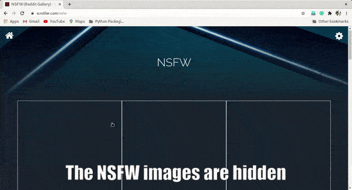

# NSFW Filter Demo

This is to demonstrate how [NSFW Filter](https://github.com/navendu-pottekkat/nsfw-filter) works.

This idea could be expanded to detect many more types of images and filter them. But for the sake of the prototype and demo, this filters Not Safe For Work content only.

The website used for the demo is [scroller/nsfw](https://scrolller.com/nsfw), which generates random NSFW images.

**Please be advised that the below image may contain graphic images**

**The images below are blurred. But in the real case they are not.**

### Without NSFW Filter

Without the NSFW filter, you can see the websites loading and showing NSFW images. **They are blurred manually for content restrictions.**

### With NSFW Filter

With the extension, you can see that it detects the NSFW images and replaces them with images from Unsplash. i.e the website is made **safe**.

