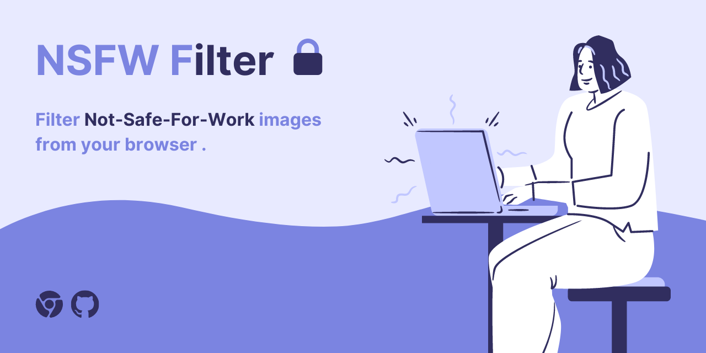
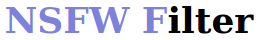
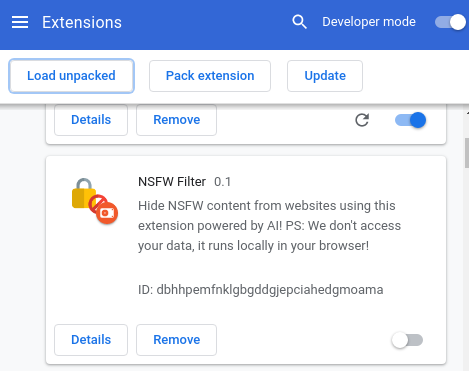
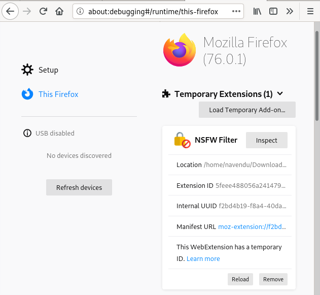

<p align="center">
  <a href="https://github.com/nsfw-filter/nsfw-filter/releases/" target="_blank">
    
  </a>

  <a href="https://github.com/navendu-pottekkat/nsfw-filter/commits/master" target="_blank">
    
  </a>

  <a href="https://github.com/navendu-pottekkat/nsfw-filter/issues" target="_blank">
    
  </a>

  <a href="https://github.com/navendu-pottekkat/nsfw-filter/pulls" target="_blank">
    
  </a>

  </br>

  <a href="https://github.com/nsfw-filter/nsfw-filter#contribute" target="_blank">
    
  </a>

  <a href="https://standardjs.com" target="_blank">
    
  </a>

  <a href="https://www.producthunt.com/posts/nsfw-filter?utm_source=badge-featured&utm_medium=badge&utm_souce=badge-nsfw-filter" target="_blank">
    
  <a/>

  <a href="https://github.com/nsfw-filter/nsfw-filter/blob/master/LICENSE" target="_blank">
    
  <a/>

  <a href="https://ctt.ac/4e4Jt" target="_blank">
    
  </a>
</p>
<hr>

A Google Chrome/Firefox extension that blocks NSFW images from the web pages that you load using TensorFlowJS.

*This extension **does NOT** collect/send any user data. All the operations on the images are done locally on the browser. No user data is being sent to a server for processing.*

<p align="center">
  
</p>

<p align="center">
  
</p>

When a web page is loaded, all the images remain hidden until they are found to be NSFW or not. If they are found to be NSFW, they remain hidden. Otherwise, they become visible.

It is free and is currently supported on both Chrome and Firefox. We are working on porting this to Safari also.
</br>
<p align="center">
  <a href="https://chrome.google.com/webstore/detail/nsfw-filter/kmgagnlkckiamnenbpigfaljmanlbbhh" target="_blank">
    
  </a>
  <a href="https://addons.mozilla.org/en-US/firefox/addon/nsfw-filter/" target="_blank">
    
  </a>
</p>

<p align="center">
<a href="https://chrome.google.com/webstore/detail/nsfw-filter/kmgagnlkckiamnenbpigfaljmanlbbhh" target="_blank"><strong>Download for Chrome</strong></a> | <a href="https://addons.mozilla.org/en-US/firefox/addon/nsfw-filter/" target="_blank"><strong>Download for Firefox</strong></a>
</p>

Read about the release in [**Hacker Noon**](https://hackernoon.com/nsfw-filter-introduction-building-a-safer-internet-using-ai-jq1e3u2f) or in [**Towards Data Science**](https://towardsdatascience.com/building-a-safer-internet-for-everyone-using-ai-175df5e02cee).

Model used - [**nsfwjs**](https://github.com/infinitered/nsfwjs) developed by [**Infinite Red, Inc.**](https://github.com/infinitered)

Reach out to us! Join the [**Slack channel**](https://join.slack.com/t/nsfwfilter/shared_invite/zt-gt1lgdiv-K2VR~UVUxwaTPWCLSmDiug).

# Table of contents

- [Usage](#usage)
- [Installation](#installation)
    - [Adding to Chrome](#adding-to-chrome)
    - [Adding to Firefox](#adding-to-firefox)
- [Contribute](#contribute)

# Usage

After adding the extension to Chrome/Firefox, it will light-up everytime you load a compatable website.

When a page is loaded, the extension would hide all the images in the page and only show images that have been classified as **NOT NSFW**.

You can toggle(off/on) the extension from the ```chrome://extensions``` page in Chrome and ```about:debugging#/runtime/this-firefox``` in Firefox.

# Installation

*For **development only**.*

Clone this repository and navigate inside the project folder and install the dependencies by running:

```sh
npm ci
```

After installing the dependencies, build the project by executing:

```sh
npm run build
```

Run the tests

```sh
npm run test
```

### Adding to Chrome

To install the developer version follow the steps below. To just use the extension download from [**chrome.google.com/webstore/nsfw-filter**](https://chrome.google.com/webstore/detail/nsfw-filter/kmgagnlkckiamnenbpigfaljmanlbbhh)

After you have finished the [Installation](#installation), open Google Chrome and open the Extension Management page by navigating to ```chrome://extensions``` or by opening Settings and clicking Extensions from the bottom left.

Enable Developer Mode by clicking the toggle switch next to Developer mode.

Click the "Load Unpacked" button and select the extension directory(```.../dist```).

<p align="center">
  
<p/>

Voila! The extension is now installed and ready to be used!

### Adding to Firefox

To install the developer version follow the steps below. To just use the extension download from [**addons.mozilla/nsfw-filter**](https://addons.mozilla.org/en-US/firefox/addon/nsfw-filter/)

After finishing [Installation](#installation), open Firefox and open the Debug Add-ons page by navigating to ```about:debugging#/runtime/this-firefox``` or by selecting it from Settings dropdown in the add-ons page.

Click Load Temporary Add-on and select the ```manifest.json``` file from the ```.../dist``` directory.

<p align="center">
  
<p/>

That's it! The extension is now ready to be used in Firefox!
<!--
### Activity Diagram


-->
# Contribute

Please check the [**Contributing Guidelines**](https://github.com/navendu-pottekkat/nsfw-filter/blob/master/CONTRIBUTING.md) before contributing.

You can also sponsor on [**Open Collective**](https://opencollective.com/nsfwfilter/donate) or [**become a Patron**](https://www.patreon.com/bePatron?u=41162696).

Thanks goes to these wonderful people ([emoji key](https://allcontributors.org/docs/en/emoji-key)):

<!-- ALL-CONTRIBUTORS-LIST:START - Do not remove or modify this section -->
<!-- prettier-ignore-start -->
<!-- markdownlint-disable -->
<table>
  <tr>
    <td align="center"><a href="https://github.com/YegorZaremba"><br /><sub><b>Yegor <3</b></sub></a><br /><a href="https://github.com/nsfw-filter/nsfw-filter/commits?author=YegorZaremba" title="Code">💻</a> <a href="#design-YegorZaremba" title="Design">🎨</a> <a href="#ideas-YegorZaremba" title="Ideas, Planning, & Feedback">🤔</a></td>
    <td align="center"><a href="http://navendu.me"><br /><sub><b>Navendu Pottekkat</b></sub></a><br /><a href="https://github.com/nsfw-filter/nsfw-filter/commits?author=navendu-pottekkat" title="Code">💻</a> <a href="#content-navendu-pottekkat" title="Content">🖋</a> <a href="https://github.com/nsfw-filter/nsfw-filter/commits?author=navendu-pottekkat" title="Documentation">📖</a> <a href="#design-navendu-pottekkat" title="Design">🎨</a> <a href="#ideas-navendu-pottekkat" title="Ideas, Planning, & Feedback">🤔</a></td>
    <td align="center"><a href="https://github.com/anonacc"><br /><sub><b>anonacc</b></sub></a><br /><a href="https://github.com/nsfw-filter/nsfw-filter/issues?q=author%3Aanonacc" title="Bug reports">🐛</a></td>
    <td align="center"><a href="https://github.com/abhirammltr"><br /><sub><b>Abhiram V V</b></sub></a><br /><a href="https://github.com/nsfw-filter/nsfw-filter/commits?author=abhirammltr" title="Code">💻</a> <a href="https://github.com/nsfw-filter/nsfw-filter/issues?q=author%3Aabhirammltr" title="Bug reports">🐛</a> <a href="#ideas-abhirammltr" title="Ideas, Planning, & Feedback">🤔</a></td>
    <td align="center"><a href="https://github.com/yxlin118"><br /><sub><b>yxlin118</b></sub></a><br /><a href="https://github.com/nsfw-filter/nsfw-filter/issues?q=author%3Ayxlin118" title="Bug reports">🐛</a> <a href="#ideas-yxlin118" title="Ideas, Planning, & Feedback">🤔</a></td>
    <td align="center"><a href="https://clay.sh"><br /><sub><b>Clay McGinnis</b></sub></a><br /><a href="https://github.com/nsfw-filter/nsfw-filter/pulls?q=is%3Apr+reviewed-by%3AClayMav" title="Reviewed Pull Requests">👀</a></td>
    <td align="center"><a href="https://www.youtube.com/channel/UCPGv2tVqEt6iBFnnMTjnRBA"><br /><sub><b>Brady Dowling</b></sub></a><br /><a href="#ideas-bradydowling" title="Ideas, Planning, & Feedback">🤔</a></td>
  </tr>
  <tr>
    <td align="center"><a href="http://littlebluelabs.com"><br /><sub><b>Mike Crittenden</b></sub></a><br /><a href="https://github.com/nsfw-filter/nsfw-filter/commits?author=mikecrittenden" title="Documentation">📖</a></td>
    <td align="center"><a href="https://github.com/garfieldbanks"><br /><sub><b>garfieldbanks</b></sub></a><br /><a href="https://github.com/nsfw-filter/nsfw-filter/issues?q=author%3Agarfieldbanks" title="Bug reports">🐛</a></td>
    <td align="center"><a href="https://github.com/TitusRobyK"><br /><sub><b>Titus Roby K</b></sub></a><br /><a href="https://github.com/nsfw-filter/nsfw-filter/issues?q=author%3ATitusRobyK" title="Bug reports">🐛</a></td>
    <td align="center"><a href="https://github.com/hsusanoo"><br /><sub><b>Haitam</b></sub></a><br /><a href="https://github.com/nsfw-filter/nsfw-filter/issues?q=author%3Ahsusanoo" title="Bug reports">🐛</a></td>
    <td align="center"><a href="https://github.com/lizhendong128"><br /><sub><b>lizhendong128</b></sub></a><br /><a href="https://github.com/nsfw-filter/nsfw-filter/issues?q=author%3Alizhendong128" title="Bug reports">🐛</a></td>
    <td align="center"><a href="https://github.com/Woctor-Dho"><br /><sub><b>Woctor-Dho</b></sub></a><br /><a href="#ideas-Woctor-Dho" title="Ideas, Planning, & Feedback">🤔</a></td>
    <td align="center"><a href="https://github.com/miaokun-normal"><br /><sub><b>miaokun-normal</b></sub></a><br /><a href="https://github.com/nsfw-filter/nsfw-filter/issues?q=author%3Amiaokun-normal" title="Bug reports">🐛</a></td>
  </tr>
  <tr>
    <td align="center"><a href="https://christopher-bradshaw.com"><br /><sub><b>Christopher Bradshaw</b></sub></a><br /><a href="https://github.com/nsfw-filter/nsfw-filter/issues?q=author%3Akitsune7" title="Bug reports">🐛</a></td>
    <td align="center"><a href="https://github.com/wingman-jr-addon"><br /><sub><b>wingman-jr-addon</b></sub></a><br /><a href="#ideas-wingman-jr-addon" title="Ideas, Planning, & Feedback">🤔</a></td>
    <td align="center"><a href="https://github.com/Andrewrick1"><br /><sub><b>Sagar paul</b></sub></a><br /><a href="https://github.com/nsfw-filter/nsfw-filter/commits?author=Andrewrick1" title="Documentation">📖</a></td>
  </tr>
</table>

<!-- markdownlint-enable -->
<!-- prettier-ignore-end -->
<!-- ALL-CONTRIBUTORS-LIST:END -->

This project follows the [all-contributors](https://github.com/all-contributors/all-contributors) specification. Contributions of any kind welcome!
