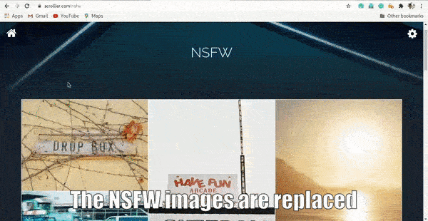
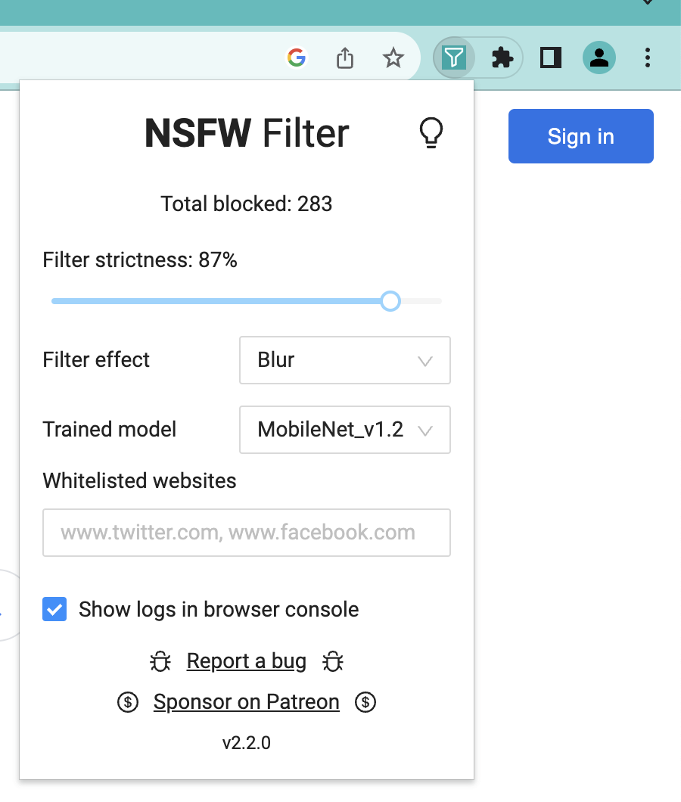
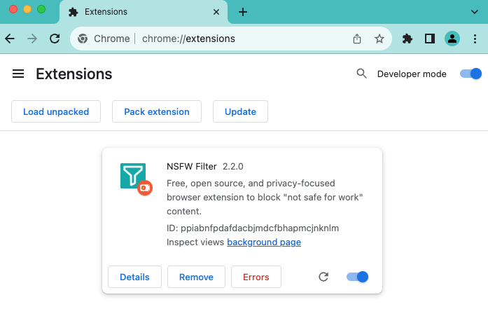

# NSFW Filter

A free, open source, and privacy-focused browser extension to block "not safe for work" content.

Built using TypeScript, TensorFlow.js, and [NSFWJS](https://github.com/infinitered/nsfwjs).

[Download now from chrome web store!](https://chrome.google.com/webstore/detail/nsfw-filter/kmgagnlkckiamnenbpigfaljmanlbbhh)



# Table of contents

- [NSFW Filter](#nsfw-filter)
- [Table of contents](#table-of-contents)
- [Usage](#usage)
- [Development](#development)
- [Contribute](#contribute)

# Usage

You can install the extension from the [chrome web store](https://chrome.google.com/webstore/detail/nsfw-filter/kmgagnlkckiamnenbpigfaljmanlbbhh) or [source](#development).

When you load web pages, NSFW Filter will first hide all images and only show those classified as safe.

To customize the extension, click the icon in your extensions tab.



# Development

Install dependencies by running:

```sh
npm install
```

Then build the project:

```sh
npm run build
```

To run the tests:

```sh
npm run test
```

To run a development version with live reload, run:

```sh
npm run dev:chrome
```

Or open Google Chrome and open the Extension Management page by navigating to ```chrome://extensions``` or by opening Settings and clicking Extensions from the bottom left.

Enable Developer Mode by clicking the toggle switch next to Developer mode.

Click the "Load Unpacked" button and select the extension directory(```.../dist```).



# Contribute

Please check the [**Contributing Guidelines**](https://github.com/navendu-pottekkat/nsfw-filter/blob/master/.github/markdown/CONTRIBUTING.md) before contributing.

Thanks goes to these wonderful people ([emoji key](https://allcontributors.org/docs/en/emoji-key)):

<!-- ALL-CONTRIBUTORS-LIST:START - Do not remove or modify this section -->
<!-- prettier-ignore-start -->
<!-- markdownlint-disable -->
<table>
  <tbody>
    <tr>
      <td align="center" valign="top" width="14.28%"><a href="https://github.com/YegorZaremba"><br /><sub><b>Yegor <3</b></sub></a><br /><a href="https://github.com/nsfw-filter/nsfw-filter/commits?author=YegorZaremba" title="Code">💻</a> <a href="#design-YegorZaremba" title="Design">🎨</a> <a href="#ideas-YegorZaremba" title="Ideas, Planning, & Feedback">🤔</a></td>
      <td align="center" valign="top" width="14.28%"><a href="http://navendu.me"><br /><sub><b>Navendu Pottekkat</b></sub></a><br /><a href="https://github.com/nsfw-filter/nsfw-filter/commits?author=navendu-pottekkat" title="Code">💻</a> <a href="#content-navendu-pottekkat" title="Content">🖋</a> <a href="https://github.com/nsfw-filter/nsfw-filter/commits?author=navendu-pottekkat" title="Documentation">📖</a> <a href="#design-navendu-pottekkat" title="Design">🎨</a> <a href="#ideas-navendu-pottekkat" title="Ideas, Planning, & Feedback">🤔</a></td>
      <td align="center" valign="top" width="14.28%"><a href="https://github.com/anonacc"><br /><sub><b>anonacc</b></sub></a><br /><a href="https://github.com/nsfw-filter/nsfw-filter/issues?q=author%3Aanonacc" title="Bug reports">🐛</a></td>
      <td align="center" valign="top" width="14.28%"><a href="https://github.com/abhirammltr"><br /><sub><b>Abhiram V V</b></sub></a><br /><a href="https://github.com/nsfw-filter/nsfw-filter/commits?author=abhirammltr" title="Code">💻</a> <a href="https://github.com/nsfw-filter/nsfw-filter/issues?q=author%3Aabhirammltr" title="Bug reports">🐛</a> <a href="#ideas-abhirammltr" title="Ideas, Planning, & Feedback">🤔</a></td>
      <td align="center" valign="top" width="14.28%"><a href="https://github.com/yxlin118"><br /><sub><b>yxlin118</b></sub></a><br /><a href="https://github.com/nsfw-filter/nsfw-filter/issues?q=author%3Ayxlin118" title="Bug reports">🐛</a> <a href="#ideas-yxlin118" title="Ideas, Planning, & Feedback">🤔</a></td>
      <td align="center" valign="top" width="14.28%"><a href="https://clay.sh"><br /><sub><b>Clay McGinnis</b></sub></a><br /><a href="https://github.com/nsfw-filter/nsfw-filter/pulls?q=is%3Apr+reviewed-by%3AClayMav" title="Reviewed Pull Requests">👀</a></td>
      <td align="center" valign="top" width="14.28%"><a href="https://www.youtube.com/channel/UCPGv2tVqEt6iBFnnMTjnRBA"><br /><sub><b>Brady Dowling</b></sub></a><br /><a href="#ideas-bradydowling" title="Ideas, Planning, & Feedback">🤔</a></td>
    </tr>
    <tr>
      <td align="center" valign="top" width="14.28%"><a href="http://littlebluelabs.com"><br /><sub><b>Mike Crittenden</b></sub></a><br /><a href="https://github.com/nsfw-filter/nsfw-filter/commits?author=mikecrittenden" title="Documentation">📖</a></td>
      <td align="center" valign="top" width="14.28%"><a href="https://github.com/garfieldbanks"><br /><sub><b>garfieldbanks</b></sub></a><br /><a href="https://github.com/nsfw-filter/nsfw-filter/issues?q=author%3Agarfieldbanks" title="Bug reports">🐛</a></td>
      <td align="center" valign="top" width="14.28%"><a href="https://github.com/TitusRobyK"><br /><sub><b>Titus Roby K</b></sub></a><br /><a href="https://github.com/nsfw-filter/nsfw-filter/issues?q=author%3ATitusRobyK" title="Bug reports">🐛</a></td>
      <td align="center" valign="top" width="14.28%"><a href="https://github.com/hsusanoo"><br /><sub><b>Haitam</b></sub></a><br /><a href="https://github.com/nsfw-filter/nsfw-filter/issues?q=author%3Ahsusanoo" title="Bug reports">🐛</a></td>
      <td align="center" valign="top" width="14.28%"><a href="https://github.com/lizhendong128"><br /><sub><b>lizhendong128</b></sub></a><br /><a href="https://github.com/nsfw-filter/nsfw-filter/issues?q=author%3Alizhendong128" title="Bug reports">🐛</a></td>
      <td align="center" valign="top" width="14.28%"><a href="https://github.com/Woctor-Dho"><br /><sub><b>Woctor-Dho</b></sub></a><br /><a href="#ideas-Woctor-Dho" title="Ideas, Planning, & Feedback">🤔</a></td>
      <td align="center" valign="top" width="14.28%"><a href="https://github.com/miaokun-normal"><br /><sub><b>miaokun-normal</b></sub></a><br /><a href="https://github.com/nsfw-filter/nsfw-filter/issues?q=author%3Amiaokun-normal" title="Bug reports">🐛</a></td>
    </tr>
    <tr>
      <td align="center" valign="top" width="14.28%"><a href="https://christopher-bradshaw.com"><br /><sub><b>Christopher Bradshaw</b></sub></a><br /><a href="https://github.com/nsfw-filter/nsfw-filter/issues?q=author%3Akitsune7" title="Bug reports">🐛</a></td>
      <td align="center" valign="top" width="14.28%"><a href="https://github.com/wingman-jr-addon"><br /><sub><b>wingman-jr-addon</b></sub></a><br /><a href="#ideas-wingman-jr-addon" title="Ideas, Planning, & Feedback">🤔</a></td>
      <td align="center" valign="top" width="14.28%"><a href="https://github.com/Andrewrick1"><br /><sub><b>Sagar paul</b></sub></a><br /><a href="https://github.com/nsfw-filter/nsfw-filter/commits?author=Andrewrick1" title="Documentation">📖</a></td>
      <td align="center" valign="top" width="14.28%"><a href="https://github.com/govza"><br /><sub><b>Rasul</b></sub></a><br /><a href="https://github.com/nsfw-filter/nsfw-filter/issues?q=author%3Agovza" title="Bug reports">🐛</a> <a href="https://github.com/nsfw-filter/nsfw-filter/commits?author=govza" title="Code">💻</a></td>
      <td align="center" valign="top" width="14.28%"><a href="https://github.com/Gother01"><br /><sub><b>Aldulkadir Beceri</b></sub></a><br /><a href="https://github.com/nsfw-filter/nsfw-filter/issues?q=author%3AGother01" title="Bug reports">🐛</a></td>
      <td align="center" valign="top" width="14.28%"><a href="https://portfolio.silloi.com/"><br /><sub><b>silloi</b></sub></a><br /><a href="#ideas-silloi" title="Ideas, Planning, & Feedback">🤔</a> <a href="https://github.com/nsfw-filter/nsfw-filter/issues?q=author%3Asilloi" title="Bug reports">🐛</a> <a href="https://github.com/nsfw-filter/nsfw-filter/commits?author=silloi" title="Code">💻</a></td>
    </tr>
  </tbody>
</table>

<!-- markdownlint-restore -->
<!-- prettier-ignore-end -->

<!-- ALL-CONTRIBUTORS-LIST:END -->

This project follows the [all-contributors](https://github.com/all-contributors/all-contributors) specification. Contributions of any kind welcome!
